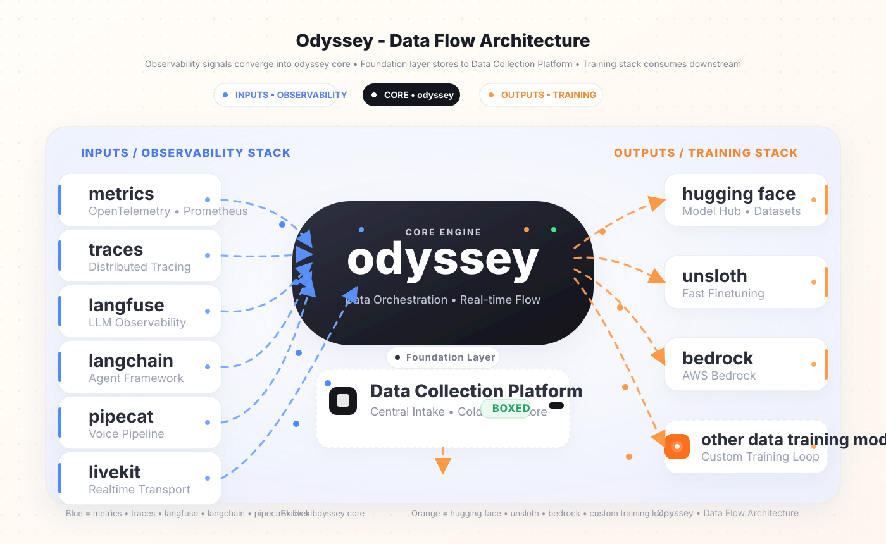

# <picture><source media="(prefers-color-scheme: dark)" srcset="https://raw.githubusercontent.com/unpod-ai/odyssey/main/docs/assets/banner_dark.png"></picture>

<p align="center">
  <strong>The Enterprise-Grade Data Engine for LLM Agents</strong><br>
  <em>Capture raw trajectories, curate high-density corpora, generate optimal finetuning configs, and run closed-loop evaluations.</em>
</p>

<p align="center">
  <a href="https://github.com/unpod-ai/odyssey/actions"></a>
  <a href="https://www.python.org/downloads/release/python-3120/"></a>
  <a href="https://nodejs.org/"></a>
  <a href="https://pnpm.io/"></a>
  <a href="https://astral.sh/uv"></a>
  <a href="https://github.com/astral-sh/ruff"></a>
</p>

---

## 🧭 Executive Summary

**Odyssey** is an end-to-end data platform designed specifically to solve the training-data loop for LLM agents. While observability platforms like Langfuse record traces to look at them, **Odyssey captures traces to fine-tune on them.**

It bridges the gap between raw, active agent interactions and heavy, offline GPU training pipelines. By combining high-efficiency edge capture with an automated curation pipeline, Odyssey programmatically converts production logs into optimal configurations for fine-tuning frameworks like **Unsloth**, **SFT**, **DPO**, and **GRPO**.

---

## 🔄 The Closed-Loop Architecture

The flowchart below represents the full, automated lifecycle of the Odyssey ecosystem. **Connections animate to show data flowing dynamically across the three key operational phases:**

<div align="center">
  
</div>

### 🏛️ Operational Pillars

#### 1️⃣ Edge Telemetry & Ingest (Real-Time Ingestion)
Active agent applications are instrumented via a lightweight, zero-dependency SDK. Production traces are spooled locally in an append-only, crash-resilient disk buffer to guarantee zero data loss. Local spools asynchronously drain to the high-throughput, multi-tenant standard-library **Collector** (`:8787`), which partitions raw bytes onto durable storage.

#### 2️⃣ Trajectory Curation & Training (Batch Curation)
Immutable raw traces undergo a programmatic **7-stage declarative pipeline** (clean ➜ normalize ➜ annotate ➜ augment ➜ validate ➜ split) to filter noise and assemble high-density datasets (such as ChatML formats). The **Soup Adapter** programmatically translates these curated datasets into validated fine-tuning configurations (`soup.yaml`) for **Unsloth**, **SFT**, **DPO**, and **GRPO** training runs.

#### 3️⃣ Model Validation & Lineage (Offline Evaluation)
Training checkpoints and registered metadata are published to a decoupled **Model Registry**. Models are served on top-tier serverless inference engines (such as **Baseten** or **Cerebras**), and generations are scored offline via the **Evaluation Harness** against frozen benchmarks. Analytical reports feed back into the read-only **API** (`:8000`) and the Next.js **Dashboard** (`:3000`) for continuous performance iteration.

---

## 📂 Monorepo Workspace Blueprint

Odyssey organizes its components inside a modern monorepo. Every subdirectory is highly isolated, ensuring clean dependency separation and deterministic build configurations.

```
odyssey/
├── packages/
│   ├── odyssey-core          # Edge capture SDK, disk-spooling, & provider integrations
│   └── odyssey-schemas       # Pydantic DTO contracts; the root of the codegen pipeline
├── cli                       # Single CLI orchestrator with lazy plugin discovery
├── services/
│   ├── collector             # High-write raw telemetry ingest gateway
│   └── api                   # FastAPI metadata catalog & evaluation report ledger
├── apps/
│   └── web                   # Next.js 15 developer portal & trajectory dashboard
├── data_preparation          # 7-stage declarative data purification pipeline
├── training                  # Soup-cli configuration adapter & model registry
└── evaluation                # Offline completion scoring & benchmark harness
```

### 🧱 Component Specifications

<details>
<summary>📦 <strong>packages/odyssey-core</strong> — <em>Zero-Dependency Edge SDK</em></summary>
<br>

- **Module**: `odyssey`
- **Core Intent**: Implements disk-buffered telemetry spooling and agent tracing.
- **Architectural Highlights**:
  - `primitives.py`: Formal definition of the unified `JourneyEvent` schema.
  - `spool.py`: Crash-resilient local disk spooler that automatically redacts sensitive credentials at record time.
  - `integrations/`: Drop-in capture wrappers for OpenAI, Anthropic, Gemini, Langchain, and LiveKit.
- **Verification**: `cd packages/odyssey-core && uv sync --extra dev && bash scripts/run_tests.sh all`
</details>

<details>
<summary>🧱 <strong>packages/odyssey-schemas</strong> — <em>The Unified API Wire Contract</em></summary>
<br>

- **Module**: `odyssey_schemas`
- **Core Intent**: Decouples API contract definitions from web-server frameworks and training backends.
- **Architectural Highlights**: Pure Pydantic models representing the exact shared schema. Generates the central `openapi.json` to automatically drive SDK client generation for both Python and JS, preventing interface drift in CI.
- **Verification**: `cd packages/odyssey-schemas && uv sync --extra dev && uv run pytest tests`
</details>

<details>
<summary>🚀 <strong>cli</strong> — <em>Optimized CLI Orchestrator</em></summary>
<br>

- **Module**: `odyssey-cli`
- **Core Intent**: The single command-line interface for the entire workspace.
- **Architectural Highlights**: Employs lazy-load dynamic command dispatch (plugin architecture). Does not import heavy dependencies (such as PyTorch, Hugging Face, or Transformers) during help-commands, preserving a strict under-700ms cold boot.
- **Verification**: `cd cli && uv sync --extra dev && uv run odyssey --help`
</details>

<details>
<summary>⚡ <strong>services/collector</strong> — <em>High-Write Ingestion Gateway</em></summary>
<br>

- **Module**: `odyssey-collector`
- **Core Intent**: Multi-tenant, secure ingestion target for edge-captured traces.
- **Architectural Highlights**: Implemented entirely via Python's standard library (no web framework overhead). Handles raw HTTP POST batch payloads, performs fast bearer auth, and date-partitions compressed raw bytes directly onto disk or S3 buckets.
- **Verification**: `cd services/collector && uv run odyssey-collector --data-dir ./collector-data`
</details>

<details>
<summary>🕸️ <strong>services/api</strong> — <em>Centrally Managed Metadata Ledger</em></summary>
<br>

- **Module**: `odyssey-api`
- **Core Intent**: Serves analytical metadata and evaluation reports.
- **Architectural Highlights**: A FastAPI service (`:8000`) designed around a read-only filesystem repository pattern. Decoupled from the collector's high-write path to guarantee query-serving isolation and robust system uptime.
- **Verification**: `cd services/api && uv run uvicorn odyssey_api.main:app --host 127.0.0.1 --port 8000`
</details>

<details>
<summary>🖥️ <strong>apps/web</strong> — <em>Visual Trajectory Dashboard</em></summary>
<br>

- **Module**: `@odyssey/web`
- **Core Intent**: Enterprise developer portal designed to visualize agent trajectories and evaluate finetuning runs.
- **Architectural Highlights**: Next.js 15 interface consuming the programmatically generated `@odyssey/sdk` package. Implements React Server Components for fast initial loads.
- **Verification**: `ODYSSEY_API_BASE_URL=http://127.0.0.1:8000 pnpm --filter @odyssey/web dev`
</details>

<details>
<summary>🎛️ <strong>data_preparation</strong> — <em>Deterministic Trajectory Curation</em></summary>
<br>

- **Module**: `odyssey-dataprep`
- **Core Intent**: Implements the 7-stage data preparation pipeline.
- **Architectural Highlights**: Programmatically normalizes unstructured telemetry logs into ChatML schemas, executes data augmentation, and validates splitting strategies before exporting.
</details>

<details>
<summary>🧠 <strong>training</strong> — <em>Fine-Tuning Config Generator</em></summary>
<br>

- **Module**: `odyssey-training`
- **Core Intent**: Maps curated datasets into production-ready configs for `soup-cli`.
- **Architectural Highlights**: Automatically generates fully validated configs (`soup.yaml`) for Unsloth-compatible SFT, DPO, and GRPO training pipelines. Manages checkpoint storage in S3 and registers lineage in the Model Registry.
- **Verification**: `odyssey train sft-config --base meta-llama/Llama-3.1-8B-Instruct --shard sft.jsonl --out soup.yaml`
</details>

<details>
<summary>🧪 <strong>evaluation</strong> — <em>Deterministic Offline Evaluation</em></summary>
<br>

- **Module**: `odyssey-eval`
- **Core Intent**: Scores offline generations against frozen benchmarks.
- **Architectural Highlights**: Does not call live APIs during scoring. Instead, matches cold-stored static model completions against benchmarks and registers evaluative statistics back to the core API.
- **Verification**: `odyssey eval run --benchmark evaluation/benchmarks/example-arithmetic.yaml --completions completions.jsonl`
</details>

---

## ⚡ Development Onboarding

### System Prerequisites
Odyssey targets **Python 3.12** exclusively to meet the strict intersection constraints of heavy downstream deep-learning adapters and monorepo telemetry libraries. Node.js 22 is required for building frontend dashboards and SDKs.

### Direct Workspace Bootstrapping
We use `Taskfile` to coordinate unified, multi-language setup steps:

```bash
task setup           # Provisions Python virtual environments (uv) and Node modules (pnpm)
task check           # Runs linter (Ruff/ESLint), formatter, types check, and test suites
task test            # Runs unit and integration test runners exclusively
```

### Command Execution examples:
```bash
odyssey --help                                                                     # Discover command plugins
odyssey spool status --spool .odyssey                                              # Inspect local Edge spool
odyssey data normalize --raw ./raw_exports --format openai_chat --out ./normalized # Normalize traces
odyssey doctor                                                                     # Run plugin health and latency diagnostics
```

---

## 🏃 Engineering Runbook (Local Development)

Follow this end-to-end runbook to spin up and test the full trace capture and evaluation cycle locally:

### 1️⃣ Spin up the Telemetry Collector (:8787)
Launches the high-throughput standard-library gateway to accept events from edge-captured agents:
```bash
cd services/collector
uv run odyssey-collector --data-dir ./collector-data
```
In your production application, configure the Odyssey SDK to spool traces to this gateway:
```python
import odyssey
odyssey.init(sink=odyssey.HttpSink("http://127.0.0.1:8787"))
```

### 2️⃣ Initialize the FastAPI Metadata Catalog (:8000)
Exposes read-only catalog endpoints over partitioned spools and model logs:
```bash
cd services/api
uv run uvicorn odyssey_api.main:app --host 127.0.0.1 --port 8000
```
*Note: Run `./scripts/codegen.sh` to automatically update client SDK code whenever schemas change.*

### 3️⃣ Start the Next.js Developer Portal (:3000)
Compile the internal TypeScript SDK client, then run the dashboard:
```bash
# Build the TypeScript SDK from the workspace root
pnpm --filter @odyssey/sdk build

# Spin up the Next.js UI
ODYSSEY_API_BASE_URL=http://127.0.0.1:8000 pnpm --filter @odyssey/web dev
```

### 4️⃣ Generate Fine-Tuning Recipes
Convert curated trajectory datasets into optimized training configs targeting Hugging Face base models:
```bash
# Compile optimal SFT training configurations
odyssey train sft-config --base meta-llama/Llama-3.1-8B-Instruct --shard sft.jsonl --out soup.yaml

# Execute training separately on your GPU cluster
soup train --config soup.yaml
```

### 5️⃣ Execute Offline Benchmark Evaluations
Compile model outputs and run deterministic evaluations:
```bash
odyssey eval run --benchmark evaluation/benchmarks/example-arithmetic.yaml --completions completions.jsonl
```

---

## 📈 Platform Maturity Milestones

The monorepo development strategy is split into six sequential phases. Every completed milestone is fully verified, type-safe, and thoroughly tested:

- [x] **Phase 0**: Preserve git history and extract the edge telemetry core library to `packages/odyssey-core`
- [x] **Phase 1**: Configure monorepo workspace configurations, version-pinning rules, and ADR blueprints
- [x] **Phase 2**: Assemble the lazy-load command line interface (`cli/`) and plugin framework (ADR 0003)
- [x] **Phase 3**: Decouple schemas into `odyssey-schemas`, deploy FastAPI API server, and generate client SDKs
- [x] **Phase 4**: Implement the 7-stage declarative `data_preparation` pipeline & metadata registries
- [x] **Phase 5**: Build the `training` soup config translation adapter, Model Cards registry, and evaluation harness
- [x] **Phase 6**: Release Next.js developer dashboard UI, JavaScript SDK, and verified basic-usage examples

---

## 📚 Complete Technical Documentation Index

Detailed architectural blueprints and operational documents are cataloged below:

| Dimension | Specification | Description |
|---|---|---|
| **🚀 Architectural Core** | [Architecture Blueprint](docs/architecture.md) | High-level data flows across Capture and Train pipelines |
| | [Component Architecture](docs/COMPONENTS.md) | In-depth technical guide of every directory's implementation |
| | [Platform Scorecard](docs/WORKING.md) | Granular line-by-line completion status of features |
| | [Structure Guidelines](docs/STRUCTURE.md) | Monorepo layout rules and developer conventions |
| **📊 Data & Lifecycles** | [Journey Event Specification](docs/journey-schema.md) | The strict wire format of agent trajectories |
| | [Client Codegen Pipeline](docs/data-contracts.md) | Automating the openapi ➜ SDK drift validation in CI |
| | [Model Lifecycle Sequence](docs/model-lifecycle.md) | Flow-state tracking from raw corpus to verified report |
| **🛡️ Infrastructure** | [Environment Specification](docs/environment-variables.md) | Full table of all load-bearing system variables |
| | [Deployment Runbooks](docs/runbooks/run-services.md) | Production setups using systemd, gunicorn, and Next.js |
| **⚙️ Deep Dives** | [odyssey-core Deep Dive](packages/odyssey-core/README.md) | Trace serialization, redaction, and agent hooks |
| | [data_preparation Pipeline](data_preparation/README.md) | Trajectory filtration, normalisation, and splitting |
| | [training Soup-cli Adapter](training/README.md) | Translating raw datasets into Unsloth SFT & DPO runs |
| **🧠 Architectural Decisions** | [ADR 0001: Monorepo Layout](docs/adr/0001-monorepo-layout.md) | Rationale behind monorepo structure |
| | [ADR 0002: Out-Of-Git Bytes](docs/adr/0002-artifacts-out-of-git.md) | Strategic decision to exclude dataset weights from VCS |
| | [ADR 0003: Single CLI Entrypoint](docs/adr/0003-single-cli-entrypoint.md) | Rationale behind the unified lazy command dispatcher |
| | [ADR 0004: Event Sourcing Only](docs/adr/0004-capture-layer.md) | Projecting cumulative trace states instead of saving state |

---

## ⚖️ License

Apache-2.0. See the `LICENSE` and `NOTICE` manifests in the root workspace or under `packages/odyssey-core`.
